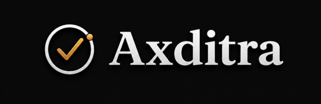
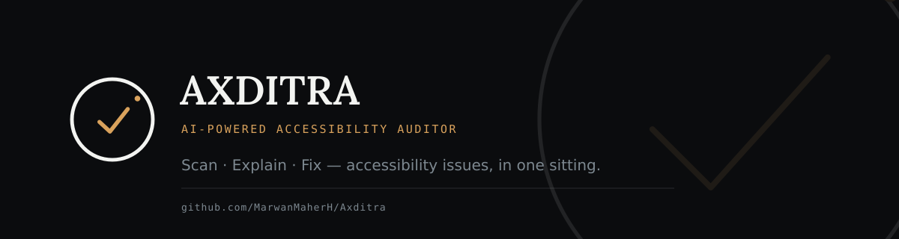

<p align="center">
  
</p>

<h1 align="center">AXDITRA</h1>

<p align="center">
AI-Powered Accessibility Auditor
</p>

<p align="center">
<b>Scan • Understand • Fix Accessibility Faster</b>
</p>

<p align="center">
AI-powered accessibility scanner that doesn't just detect issues — it explains them and generates production-ready fixes.
</p>

<p align="center">


</p>

---

<p align="center">

</p>

---

# 📖 Overview

Accessibility tools usually stop after telling developers **what is wrong**.

**AXDITRA** goes several steps further.

It scans any public website using **Playwright** and **axe-core**, explains every accessibility issue using **Claude AI**, and instantly generates production-ready HTML fixes developers can copy directly into their projects.

Instead of reading long WCAG documentation, developers receive simple explanations and actionable fixes within seconds.

---

# ✨ Features

| Feature | Description |
|----------|-------------|
| 🔍 Live Accessibility Scan | Analyze any public website using Playwright + axe-core |
| 📊 Accessibility Score | Transparent scoring system from 0–100 |
| 🤖 AI Explanations | Claude explains every issue in plain English |
| 🛠 AI HTML Fixes | Generates production-ready accessible HTML |
| 📋 Copy Ready Code | Copy generated fixes instantly |
| 📧 Waitlist API | Built-in waitlist endpoint |
| ✉ Optional Emails | Confirmation emails using Resend |
| ⚡ Fast Reports | Results in seconds |

---

# ⚙️ How It Works

```text
           Website URL
                │
                ▼
      Playwright Chromium
                │
                ▼
          axe-core Scanner
                │
                ▼
     Accessibility Violations
                │
                ▼
          Claude AI Analysis
                │
                ▼
 Explanation + HTML Fix + Score
```

---

# 🖼 Screenshots

## Landing Page

<p align="center">

</p>

---

## Accessibility Report

<p align="center">

</p>

---

## AI Explanation

<p align="center">

</p>

---

## Dashboard

<p align="center">

</p>

---

# 🛠 Tech Stack

| Layer | Technology |
|--------|------------|
| Runtime | Node.js |
| Backend | Express |
| Browser Automation | Playwright |
| Accessibility Engine | axe-core |
| Artificial Intelligence | Anthropic Claude |
| Storage | JSON |
| Email | Resend |

---

# 🚀 Quick Start

## Clone the Repository

```bash
git clone https://github.com/MarwanMaherH/Axditra.git

cd Axditra
```

## Install Dependencies

```bash
npm install
```

## Install Chromium

```bash
npx playwright install chromium
```

## Configure Environment

```bash
cp .env.example .env
```

Add your API key

```env
ANTHROPIC_API_KEY=YOUR_API_KEY
```

Run the application

```bash
npm start
```

Open

```
http://localhost:3000/app.html
```

---

# 📂 Project Structure

```
Axditra
│
├── assets/
│   ├── logo.png
│   ├── banner.png
│   ├── dashboard.png
│   ├── explain.png
│   ├── scan-result.png
│   └── marwan.jpg
│
├── public/
│   ├── index.html
│   └── app.html
│
├── server.js
├── package.json
├── README.md
└── .env.example
```

---

# 🗺 Roadmap

- ✅ Accessibility Scanner
- ✅ AI Explanations
- ✅ AI HTML Fix Generator
- ✅ Waitlist API
- 🔄 Authentication
- 🔄 User Dashboard
- 🔄 GitHub Pull Request Generator
- 🔄 Scan History
- 🔄 Team Collaboration
- 🔄 Cloud Deployment
- 🔄 VS Code Extension

---

# 💡 Why AXDITRA?

Traditional accessibility tools typically generate reports like:

```text
color-contrast
button-name
duplicate-id
aria-label
```

Developers are then expected to search documentation and figure out how to solve each issue manually.

AXDITRA removes that friction by providing:

- ✅ Plain-English explanations
- ✅ AI-generated HTML fixes
- ✅ Accessibility best practices
- ✅ Faster development workflow
- ✅ Better WCAG compliance

---

# 👨‍💻 About the Creator

<p align="center">

</p>

## Marwan Maher

**Software Engineer**

Passionate about building AI-powered developer tools, accessibility solutions, automation systems, and modern web applications.

### Connect

- 🌐 GitHub: https://github.com/MarwanMaherH
- 💼 LinkedIn: https://linkedin.com/in/marwanmaher
- 🐦 X: https://x.com/MarwanMaherH

---

# 🤝 Contributing

Contributions, feature requests, bug reports, and pull requests are always welcome.

If you'd like to improve AXDITRA, feel free to fork the repository and submit a Pull Request.

---

# 📄 License

This project is licensed under the MIT License.

---

<p align="center">

## ⭐ If you like this project, consider giving it a Star!

Made with ❤️ by **Marwan Maher**

</p>